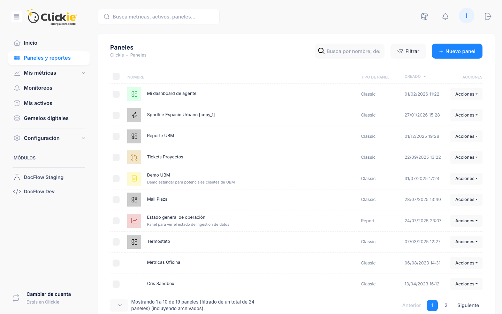

# Paneles y reportes

El módulo **Paneles y reportes** permite construir visualizaciones persistentes para seguimiento operativo y análisis periódico.

## Captura de la sección

*Vista del listado de paneles con búsqueda, filtros y acciones por registro.*

## Datos del listado

Cada elemento del listado incluye:

- Nombre del panel
- Tipo de panel
- Fecha y hora de creación
- Acciones disponibles

## Acciones comunes

- **Ver**: abre el panel o reporte con sus widgets.
- **Información**: muestra metadatos (ID, fechas, etc.).
- **Modificar**: permite editar configuración.
- **Archivar**: oculta el panel del listado principal sin eliminarlo.

## Filtros disponibles

- Tipo: Classic
- Tipo: Report
- Archivado / no archivado

## Referencias

- [Visor de datos](./visor-datos.md)
- [Selector de métricas](../conceptos/selector.md)
