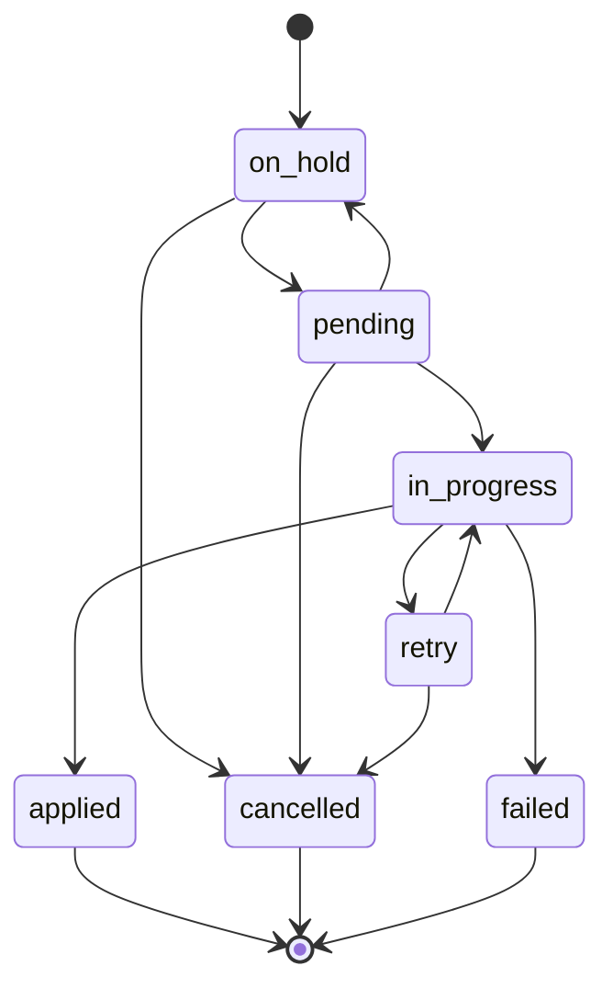
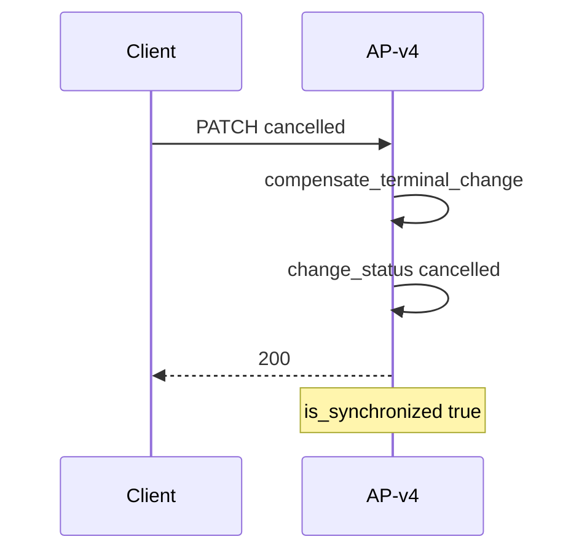
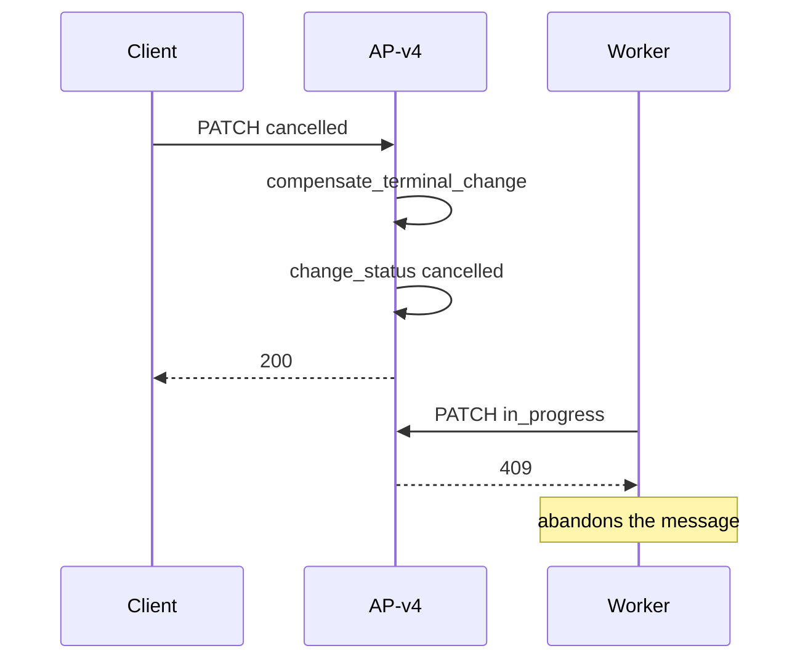
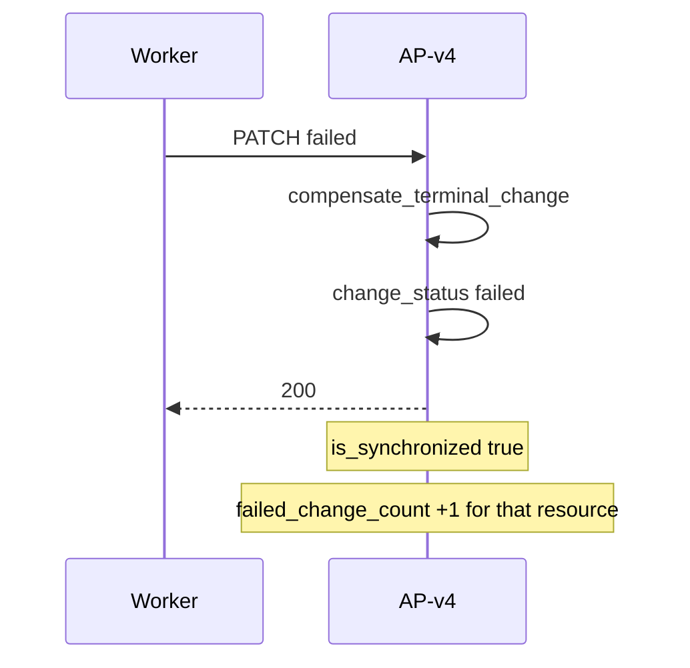
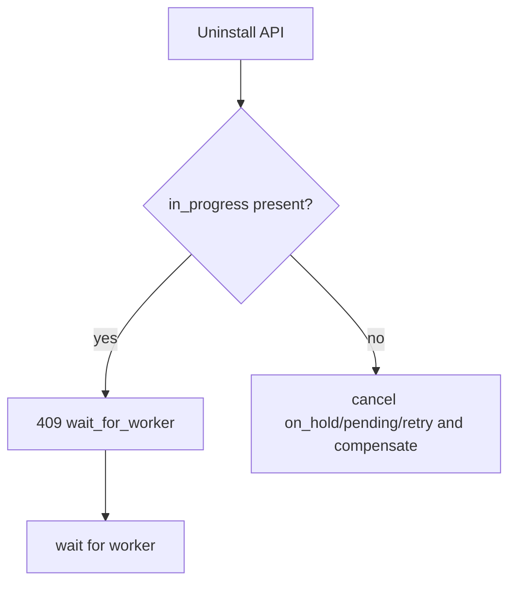
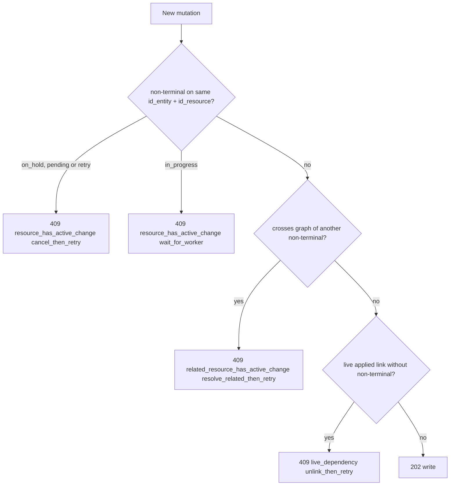

# MGD config-change state machine

This state machine applies only to `/mgd/*`. The API owns the canonical
mutation, the history row, compensation on `cancelled`/`failed`, and the
status transition. The external worker does not write MGD tables; it only
calls the status endpoints.

## States and transitions

```text
on_hold     -> pending | cancelled
pending     -> on_hold | in_progress | cancelled
in_progress -> retry | applied | failed
retry       -> cancelled | in_progress
applied, cancelled, failed -> terminal
```



`requested` is historical only. Migration maps `requested` to `on_hold`; new
writes never accept it. The worker reports `in_progress`, `retry`, `failed`,
or `applied`, and `cancelled` only from `retry`. An operator can cancel
`on_hold`, `pending`, and `retry`. AP-v4 owns `on_hold` and `pending`.
Repeating the current status is idempotent.

| State | Meaning | Terminal |
| --- | --- | --- |
| `on_hold` | Recorded, but installation or dependency rules do not yet allow dispatch. | No |
| `pending` | Eligible for the external processor; AP-v4 may send SQS. | No |
| `in_progress` | Worker has started processing. | No |
| `retry` | Worker may try again. | No |
| `applied` | Worker confirmed the device result; the canonical row was already written. | Yes |
| `cancelled` | The intent was abandoned; the API compensated the canonical row. | Yes |
| `failed` | Worker exhausted retries and asserts the device does **not** have the new value; the API compensated Clickie. | Yes |

`failed` is terminal. After compensation, `is_synchronized=true`: Clickie and
the device are back on the previous value. The worker may send `failed` only
when it can assert that the device does not have the new value; otherwise it
must stay in `retry` or `in_progress`. Do not use `failed` for “the user gave
up”. Reconciliation may demote `pending -> on_hold` when the target is no
longer installed.

Cancellable states are `{on_hold, pending, retry}`. `pending` can be cancelled
safely under the row lock: if the worker has already advanced to
`in_progress`, the cancel returns `409`; if the cancel wins, a later worker
transition is illegal and also returns `409`. In either case the worker
abandons the message. `in_progress` is not cancellable.

## Eager write and `applied`

An operational mutation persists the entity table and the history row together.
Clickie shows the new value immediately; the device keeps the previous value
until `applied`. Creates use the real primary key as `id_resource`. Deletes
store in `before_value` the domain snapshot needed to restore the row.

When the worker calls:

```http
PATCH /mgd/gateways/{id_setup}/config-changes/{change}/status
{"change_status":"applied","scheduled_at":"2026-08-25T12:34:56Z"}
```

`scheduled_at` is optional on individual and bulk status PATCH requests. When
the worker sends it, the API persists it with the transition; when omitted,
the existing row value is preserved. An explicit `null` clears the value. The
importer does not write `scheduled_at`; its effective changes are recorded
directly as `applied`.

the API, in one transaction:

1. locks and validates the change;
2. checks that the live row still matches the post-mutation value;
3. marks `applied` and `applied_at` without creating or updating the entity
   again.

If the live row diverged, the API returns `409`. The worker must abandon the
message and must not retry until `applied`. Bulk `PATCH` for
`cancelled`/`failed` orders creates newest-first, then updates, then restore
of deletes oldest-first. A `FOR UPDATE` lock serializes cancel against
`in_progress`.

`cancelled` and `failed` compensate create/update/delete **before** writing
the terminal status. After compensating `failed`, `is_synchronized=true`.
`cancelled` means the user gave up. Cancelling `pending` also compensates
Clickie in that transaction. If the worker arrives later with an illegal
transition, AP-v4 returns `409` and the worker abandons the message without
changing another state. `in_progress` is not cancellable. Demotions
`pending → on_hold` do not compensate: Clickie keeps the eager value.

## Eligibility and promotion

A gateway or child target can become `pending` only when it has an active main
installation: `device_setups.setup_uninstall_date IS NULL`,
`device_setup_is_accessory = false`, and the associated `devices` row is not
deleted. Gateway and child are independent targets.

A mutation may promote related `on_hold` changes in the same branch. Closure
uses real foreign keys and `id_setup_target`. It does not promote siblings or
resources of another component.

Reconciliation is not a user undo. It is:

```http
POST /mgd/setups/{id_setup}/config-changes/reconcile
{"include_children": true}
```

- Installed target + `on_hold` + dependencies ready → `pending` (and SQS).
- Target not installed + `pending` → `on_hold`. The canonical row is not
  touched: Clickie keeps the eager value. After reinstall, the same change
  can become `pending` again.
- `in_progress`, `retry`, and terminals are not moved.
- `GET` never reconciles or promotes.
- `include_children` expands the set only on the **gateway** path
  (`gateway ∪ children`). On a child path it is a documented no-op: it does
  not add the gateway or siblings.
- Installing or replacing a main device calls gateway `reconcile` with
  `include_children=true`. A resource `POST` does not reconcile the tree; it
  only applies the use-edge it just wrote.

Uninstall is a different path: it cancels cancellable rows and **does**
compensate, because the setup is no longer deployed. Accessories neither
enable nor cancel MGD changes for the setup.

A schedule may exist without a point group. It is a valid resource, but its
change stays `on_hold` until the relationship required for dispatch exists.
`everyday` is a point-group rule, not a device-config rule.

### Use-edge promotion (option B)

There are two graphs. **Ownership** follows `id_setup_target` (group → device
config → child; schedule → component → gateway). **Use** edges gate dispatch:
`point_group.id_setup_gateway_schedule` and `extension_schedules`. Walking
ownership from a child group never reaches the schedule.

When a `POST`/`PUT` writes `group → schedule` (group create or binding, or a
component binding PUT), AP-v4 promotes **that schedule** and the extensions
(and `extension_schedules` joins) already bound to it if:

- each row’s target is installed (the gateway, for schedule, extension, and
  join);
- that row’s latest change is `on_hold`;
- the dispatch predicate is already true (the schedule has at least one live
  point group; the extension is bound to such a schedule).

It does not reconcile the gateway, promote siblings of the child, promote
extensions bound to **another** schedule, or use `include_children`. Attaching
an existing extension promotes that extension, not the schedule and not other
extensions of the same component.

`CREATE`, `UPDATE`, and `reconcile` share `change_dependencies_are_ready`. A
detached schedule, group, membership, or extension stays `on_hold` even if the
target is installed. A gateway `reconcile` does not pend detached extensions.
An extension is dispatchable only when it is bound to a schedule that itself
is dispatchable (the schedule has a live point group) and the gateway is
installed. A detached `CREATE` is always `on_hold`.

## Cancellation and retention

`on_hold`, `pending`, and `retry` can become `cancelled`. The `FOR UPDATE` row
lock serializes cancellation against `in_progress`: if the worker has already
advanced, cancellation returns `409`; if cancellation wins, a later worker
PATCH is an illegal transition and also returns `409`. In either case the
worker abandons the message without changing the state. Cancellation
compensates Clickie in the same transaction. `in_progress` is not cancellable;
`applied` and `failed` are terminal.

On `retry` the worker has said it will try again and has not yet returned to
`in_progress`, so cancel is allowed. Uninstall and import with `force=true`
cancel `on_hold`, `pending`, and `retry`; they return `409` only when a row is
`in_progress`.

Cancel keeps history, does not publish SQS, and undoes the canonical row.
There is no `config-changes` DELETE endpoint.

Synchronization uses the latest row per `(id_entity, id_resource)`. After
`applied`, compensated `cancelled`, or compensated `failed`,
`is_synchronized=true`. While the latest row is non-terminal,
`is_synchronized=false`.

`failed_change_count` is telemetry. It counts resources whose **current**
latest row is `failed`. It is not a historical accumulator: a later `applied`
or `cancelled` on the same resource removes it from the count. It does not
drive the synchronized boolean.

`canonical_value_may_not_be_applied` is the same predicate as unresolved: the
latest row is non-terminal. With eager write, Clickie already has the value;
the device may lag until a terminal. On a resource GET/202 that predicate is
only for that row; on `GET .../config-sync` it is the setup rollup.

## Concurrent edits and per-resource sync

`id_setup_target` is not an edit mutex. It is used for installation,
reconcile, listing, SQS, and uninstall. With eager write, a child is
configured by independent resources: a `pending` point group does not block
creating a new device-point on the same child. The device catches up when the
worker applies the **gateway snapshot**, not row by row.

The same `change_group_key` in one transaction may still record several
related resources.

### Conflict A — same resource

A non-terminal exists for the same `(id_entity, id_resource)` under another
`change_group_key`. There is no second PUT/DELETE of that row until a
terminal or `retry`. `next_action` is `cancel_then_retry`
(`on_hold`/`retry`) or `wait_for_worker` (`pending`/`in_progress`).

`reason`: `resource_has_active_change`. The 409 names the change, the status,
and `look_at` (resource GET or that change’s PATCH).

### Conflict B — related resource

The operation is valid on this row, but the graph would become inconsistent
with a non-terminal on **another** row linked by FK or membership. It is not
blocked “because it is the same child”.

`reason`: `related_resource_has_active_change`. `next_action`:
`resolve_related_then_retry`. The 409 includes `related` (entity, resource,
`relation`, change, status), `look_at` (GET of that related row), and a
`detail` that says what to inspect and why.

Typical B edges:

| Operation | Non-terminal on | Typical `relation` |
| --- | --- | --- |
| DELETE a device-point | PUT of a point group that still lists it | `point_group_points` |
| DELETE a device-config | CREATE `pending` of a point or other child | parent `device_config` |
| DELETE a schedule | `pending` point group that references it | `id_setup_gateway_schedule` |
| PUT a group that adds point N | DELETE `pending` of point N | `point_group_points` |
| DELETE a schedule | `pending` extension that references it | `extension_schedules` |

Not B: POST of a point the `pending` group does not mention; PUT of fields
that do not cross that edge; sibling creates that do not collide on UNIQUE.

Native UNIQUE/FK collisions remain separate 409s, distinct from A and B.

### Catalog conflict — live applied link

If there is no non-terminal on the graph and a non-recursive DELETE is still
blocked because the live row still has an **applied** FK or membership, the
409 is catalog, not A or B.

`reason`: `live_dependency`. `next_action`: `unlink_then_retry`. `look_at`
points at the GET of the resource that still links (for example the point
group). Unlink that resource (or delete recursively) and retry.

### Sync surfaces

| Surface | Scope of `is_synchronized` |
| --- | --- |
| Resource GET/202 with `include_config_sync` | That row only |
| `GET .../config-sync` | Setup rollup plus `resources[]` per resource |

A point may be synchronized while a group on the same child is still
`pending`. The child rollup asks whether the device has caught up with
**this whole setup**. That is not the hint to hang off a point GET.

`failed_change_count` on the rollup counts resources whose latest row is
`failed`. It does not mark the rollup unsynchronized: that `failed` already
compensated.

```json
{
  "id_setup": 501234,
  "is_synchronized": false,
  "unresolved_change_count": 1,
  "failed_change_count": 0,
  "resources": [
    {
      "id_entity": 91,
      "id_resource": 3,
      "is_synchronized": true,
      "latest_change_status": "applied"
    },
    {
      "id_entity": 92,
      "id_resource": 45,
      "is_synchronized": false,
      "latest_change_status": "pending",
      "latest_change_id": 9001
    }
  ]
}
```

Uninstall and import `force` cancel `pending` rows at that target and return
`409` only when a row is `in_progress`. Reconcile can still demote `pending`
to `on_hold` without compensation. That is device lifecycle, not the
point-edit mutex.

## Who triggers compensation

The internal function is always `compensate_terminal_change` (create deletes,
update restores `before_value`, delete recreates from the snapshot). If that
function returns `409`, the terminal status is not written.

| Path | HTTP | Compensates | Resulting status |
| --- | --- | --- | --- |
| Operator or worker closes `cancelled` | `PATCH .../config-changes/{id}/status` or bulk | yes, **before** marking | `cancelled` |
| Worker closes `failed` | same PATCH | yes, **before** marking | `failed` |
| Worker closes `applied` | same PATCH | no; only confirms the live row | `applied` |
| Setup uninstall | not that PATCH; cancels cancellable rows | yes, `on_hold`/`pending`/`retry` → `cancelled` | `cancelled` |
| Import `force=true` | `POST .../imports` | yes, `on_hold`/`pending`/`retry` → `cancelled` | `cancelled` |
| Reconcile `pending → on_hold` | `POST .../reconcile` | **no** | `on_hold` |

`failed` is not produced by uninstall or import. Only the status PATCH from
`in_progress`.

Worker contract: `PATCH in_progress` **before** mutating the device. If that
PATCH returns `409`, abandon the message and do not touch the device.

## Processes

### Applied mutation

```mermaid
sequenceDiagram
    participant C as Client
    participant API as AP-v4
    participant W as Worker
    C->>API: POST/PUT/DELETE resource
    API->>API: write entity and log
    API-->>C: 202
    Note over API: pending sends SQS; on_hold does not
    W->>API: PATCH in_progress
    API-->>W: 200
    W->>W: apply on device
    W->>API: PATCH applied
    API->>API: confirm live row
    API-->>W: 200
    Note over API: is_synchronized true
```

### Cancel `on_hold` (never dispatched, or demoted)

`on_hold` remains cancellable. After a demote `pending → on_hold` the worker
cannot move to `in_progress`; if it honors the contract, it did not mutate the
device. Cancel compensates Clickie and closes sync. If the device is no longer
installed: reconcile first (demote), then cancel or uninstall.



### Cancelling `pending` (SQS may already have left)

Cancellation compensates Clickie. If the worker later tries `in_progress` or
`applied`, it receives `409` and terminates without writing another state.



### Worker `failed`

The worker sends `failed` only if the device does **not** have the new value.



### Uninstall with `in_progress`



### Concurrent mutation 409



### Import

`force=false` with only `on_hold`/`pending`/`retry`: `409 cancel_then_retry`
(retry with `force=true`). If any row is `in_progress`: `409 wait_for_worker`
even when `force=true`.

## Recursive deletes and scope

A recursive delete uses a shared `change_group_key` for the entity and its
links. The resolver stays on the requested target: it does not reach siblings
or other components. If a dependency cannot be resolved, the API keeps a
partially rejected delete from committing and rolls back the whole
transaction.

## SQS, worker snapshot, and replay

When promoting to `pending`, the API commits and sends the aggregate event
directly to SQS. The payload is `{id_setup_gateway, id_account}`: the worker
applies the **canonical gateway snapshot**, not row by row. It must
`PATCH applied` **every** `pending` change that snapshot materialized (group,
schedule, extension, and join if they became pending). If it writes the
schedule or extension on the device and leaves the change `on_hold`,
`config-sync` will show drift. `PATCH in_progress` **before** mutating the
device; a `409` abandons the message.

The response/log includes `request_id` and `message_id`. If send fails:

```http
POST /mgd/setups/{id_setup}/config-changes/replay
```

resends existing `pending` rows. It does not create an outbox table, rewrite
the entity, or change status.

## Importer

`POST /mgd/gateways/{id_setup}/imports` is the reverse path. It receives an
effective JSON document as a complete snapshot, upserts present rows and
deletes absent MGD rows from the gateway, recording every effective create,
update, or delete as `applied`. `dry_run` rolls everything back, `strict`
turns flags into errors, and `force` cancels `on_hold`, `pending`, and `retry`.
If any row is `in_progress`, the API returns `409` even with `force`. The
importer preserves `config_changes` history and global catalogs; it is not
proposal-only: it writes entities and records `applied`.

## HTTP errors

`400` is invalid input or scope. `404` is a resource absent from the requested
account/gateway/child. `409` is uniqueness, graph, state-transition,
cancellation, or optimistic-precondition conflict. The envelope merges
`exc.context`. A `500` is an implementation defect, not a domain result.
