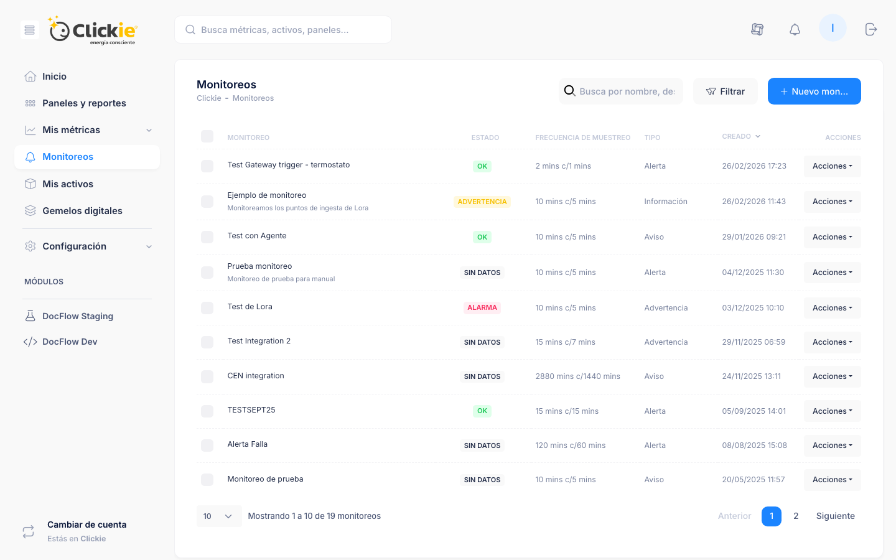

# Monitoreos

El módulo **Monitoreos** evalúa condiciones sobre métricas y genera estados operativos automáticos para detección temprana, seguimiento y comunicación.

:::module-strip
Monitoreos convierte comportamiento de datos en alertas operativas. El objetivo es detectar desvío, priorizar impacto y comunicar al equipo correcto con reglas claras.
:::

## Captura de la sección

*Vista del módulo Monitoreos con estado operativo, tipo y frecuencia de cada regla.*

## Qué aporta a la operación

Monitoreos transforma datos continuos en señales accionables.

En la práctica permite:

- detectar desvíos a tiempo,
- priorizar eventos por severidad,
- y notificar al equipo correcto con la frecuencia adecuada.

## Listado de monitoreos

Cada monitoreo incluye:

- nombre,
- tipo,
- severidad,
- estado actual,
- fecha de creación/actualización,
- acciones disponibles.

Tipos de monitor frecuentes:

- Aviso
- Información
- Advertencia
- Error
- Crítico
- Alerta
- Emergencia
- Depuración

Estados operativos:

- OK
- Advertencia
- Alarma
- Sin datos

## Flujo de configuración recomendado

:::steps
1. **Crear monitoreo base**: Desde **Monitoreos** elegir **+ Nuevo monitoreo** y definir nombre, tipo, ventana y frecuencia de evaluación.
2. **Definir reglas**: Ingresar al monitoreo, abrir **Reglas** y asignar métrica, método (`Mayor que`, `Menor que`, `Dentro de rango`, `Fuera de rango`) y umbral.
3. **Configurar disparadores**: En **Disparadores** crear notificación o reenvío de evento y completar estado, patrón de tiempo y destinatarios.
:::

## Ejemplo práctico: monitoreo de factor de potencia

Caso de referencia para capacitación:

- **Métrica**: `F. de Pot.`
- **Regla**: entrar en alarma cuando en una ventana de 10 min al menos el 10% de los puntos esté por debajo de 0.93.
- **Frecuencia de evaluación**: cada 5 min.

Configuración en tres pasos lógicos de Clickie:

:::steps
1. **Monitoreo**: Nombre `Control de Factor de Potencia`, tipo `Alerta`, ventana de muestreo `10 min`, frecuencia `5 min`.
2. **Regla**: Nombre `F. de Pot.`, método `Menor que`, límite `0.93`, umbral `10%`.
3. **Disparador**: Tipo `Comunicacion`, disparar en estado `ALARMA`, patrón de tiempo según operación, notificar a colaboradores responsables.
:::

:::monitoring-example-fpot
:::

Tipos de disparador:

- Comunicación (notificaciones)
- Reenvío de evento (endpoint personalizado)

Campos habituales:

- estado disparador,
- observaciones,
- patrón de tiempo,
- colaborador o destinatario,
- título/resumen/contenido de la comunicación.

## Diseño de alertas útiles

Para evitar ruido y fatiga de alertas:

- usar severidades coherentes con el impacto real,
- separar reglas de advertencia y crítica,
- definir ventanas de tiempo acordes al proceso,
- revisar periódicamente reglas que no agregan valor.

## Referencias

- [Métricas y fórmulas](../conceptos/metricas.md)
- [Selector de métricas](../conceptos/selector.md)
- [Visor de datos](../analisis/visor-datos.md)
