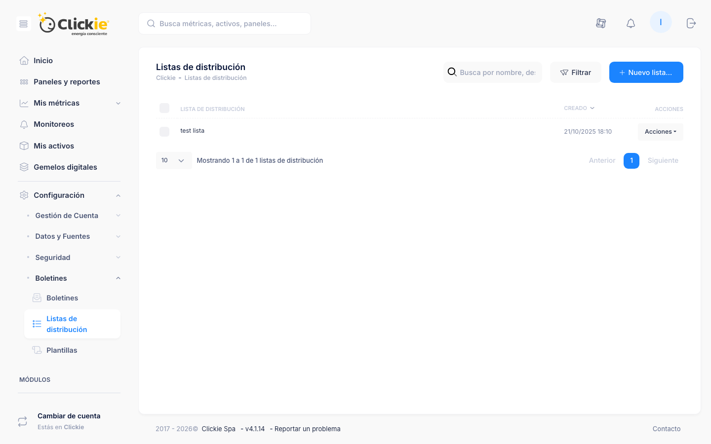

# Boletines - Grupos de destinatarios

Los grupos de destinatarios reúnen personas que recibirán boletines en conjunto.
Funcionan como contenedores reutilizables para segmentar equipos y cohorts de usuarios con objetivos operativos comunes.

:::module-strip
Usar grupos aporta consistencia, reduce trabajo manual y mejora gobernanza cuando los boletines forman parte de acuerdos de servicio o reportes regulatorios.
:::

## Captura de la sección

*Vista de grupos/listas de destinatarios con búsqueda, filtros y acciones de mantenimiento.*

## Por qué usar grupos en lugar de destinatarios sueltos

- Cada boletín hereda automáticamente cambios del grupo.
- Se reutilizan en múltiples boletines e idiomas.
- Permiten delegar gestión de contactos con permisos limitados.
- El indicador de uso evita cambios con impacto no deseado en envios activos.
- Garantizan que solo usuarios vigentes de la plataforma reciban comunicación.

## Acceso y listado

- Ruta: **Configuración -> Boletines -> Grupos de destinatarios**.
- Tabla con búsqueda, orden por fecha y acciones masivas.
- **Crear grupo** solicita nombre y descripción.
- Columnas de miembros y uso ayudan a priorizar mantenimiento.

## Detalle de un grupo

Encabezado con:

- identificador interno,
- descripción funcional,
- resumen de miembros,
- cantidad de boletines que lo consumen,
- acciones de edición/eliminación según permisos.

## Pestaña Resumen

- Tarjetas con totales de miembros y boletines vinculados.
- Fecha de última actualización.
- Atajos para crear boletín nuevo o duplicar grupo.

## Pestaña Uso en boletines

- Tabla de solo lectura con boletines que usan el grupo.
- Estado y próxima ejecución para evaluar impacto antes de editar audiencia.

## Pestaña Miembros

- Tabla de miembros por fecha de incorporación.
- **Agregar miembro** para vincular usuarios habilitados.
- Acciones por fila para pausar o quitar miembros.
- Contador de idiomas para revisar compatibilidad de plantillas.

## Pestaña Configuración

- Edición de nombre y descripción.
- Registro de auditoría (último editor y fecha).
- Cambios se reflejan automáticamente en boletines que reutilizan el grupo.

## Mejores prácticas

- Usar nombres de grupo descriptivos (ejemplo: "Equipo Operaciones LATAM").
- Revisar periódicamente indicador de uso y limpiar grupos obsoletos.
- Preferir administración centralizada desde Grupos para sostener consistencia.
- Duplicar un grupo antes de pruebas para no afectar audiencias activas.

## Referencias

- [Boletines](./boletines.md)
- [Boletines - Plantillas](./boletines-plantillas.md)
