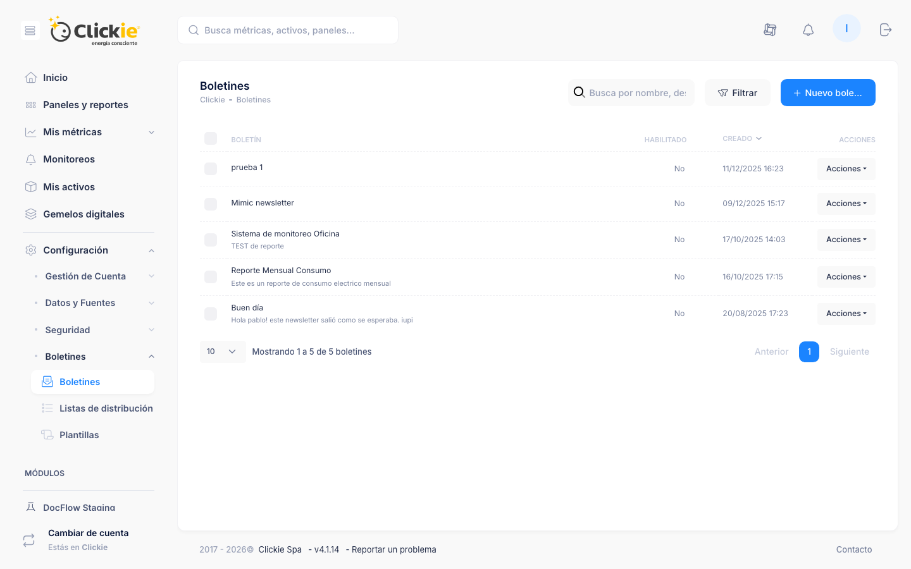

# Boletines

Los boletines permiten compartir información periódica con audiencias definidas dentro de la plataforma.
Cada envío combina contenido dinámico basado en métricas con bloques editoriales y se distribuye automáticamente según la programación indicada.

:::module-strip
Boletines está pensado para automatizar reportes recurrentes, reducir tareas manuales y mantener equipos y stakeholders alineados con la evolución de datos.
:::

## Captura de la sección

*Vista de Boletines con estado de envíos, búsqueda y acciones por boletín.*

Cada boletín coordina tres componentes:

- **Destinatarios**: usuarios individuales o grupos reutilizables de la plataforma.
- **Plantilla**: estructura visual y estilos comunes para todos los envíos.
- **Bloques de contenido**: componentes ordenables para texto, KPIs y graficos.

## Cuándo crear un boletín

- Cuando necesitas comunicar resultados periódicos (diarios, semanales o mensuales) sin exportaciones manuales.
- Cuando quieres distribuir paneles o métricas clave a una audiencia acotada y mantener historial de envío.

## Acceso y vista general

- Ruta: **Configuración -> Boletines -> Boletines**.
- La tabla principal incluye búsqueda global, filtros por plantilla y acciones masivas.
- El botón **Crear boletín** abre un formulario inicial con nombre y descripción.
- El listado muestra estado (Activo/Pausado), plantilla y señales de salud para detectar boletines detenidos.

## Estructura de la ficha del boletín

El encabezado del detalle muestra:

- estado y acción rápida para activar o pausar,
- identificador interno, plantilla, patrón horario y zona horaria,
- resumen de envíos (último/próximo disparo y cantidad de destinatarios),
- acciones contextuales según permisos (editar, duplicar, eliminar, enviar manualmente).

## Pestaña Resumen

- Historial de envíos con totales enviados/fallidos y tasa de entrega.
- Direcciones suprimidas para identificar rebotes o bajas.
- Cronología de ejecuciones con próximos disparos y eventos completados.

## Pestaña Diseño

- Columna de **bloques de contenido** con orden, edición y eliminación.
- **Vista previa** interactiva con fecha de referencia para validar variables relativas.
- Para perfiles administrativos: modo depuración y acción **Enviar ahora**.

## Pestaña Destinatarios

- Tabla de audiencia por tipo (usuario o grupo).
- Formulario de alta con selector por tipo de destinatario.
- Soporte de filtros por cuenta/idioma para reutilizar grupos.
- Solo se admiten miembros activos de la plataforma.

## Pestaña Historial

- Lista de despachos ejecutados con estado y marca temporal.
- Vista de detalle por despacho para revisar destinatarios y diagnosticar fallos.

## Pestaña Configuración

- Formulario completo: nombre, descripción, plantilla, patrón horario y zona horaria.
- Cambios de patrón/horario recalculan próximos disparos.
- Si el boletín está pausado, no se ejecuta ninguna programación.

## Organizacion recomendada de contenido

:::steps
1. **Abrir contexto**: Comenzar con un bloque narrativo (Free Text) que explique objetivo y alcance.
2. **Priorizar datos**: Ubicar KPIs y tendencias por importancia de negocio.
3. **Cerrar con acción**: Agregar recordatorios operativos o próximos pasos.
4. **Validar antes de enviar**: Usar vista previa y modo depuración para revisar cálculos y consistencia visual.
:::

## Bloques disponibles

Catálogo actual:

- **Free Text**
- **KPI Snapshot**
- **Line Chart**
- **Bar Chart**

Para detalle de parámetros y casos de uso, revisar [Boletines - Bloques de contenido](./boletines-bloques.md).

## Buenas prácticas operativas

- Mantener solo bloques necesarios para facilitar lectura.
- Coordinar cambios de plantilla con administradores de estilos.
- Revisar rebotes periódicamente para limpiar audiencias inactivas.
- Documentar objetivo del boletín en descripción para facilitar reutilización.

## Recursos complementarios

- [Boletines - Grupos de destinatarios](./boletines-grupos.md)
- [Boletines - Plantillas](./boletines-plantillas.md)
- [Boletines - Bloques de contenido](./boletines-bloques.md)
