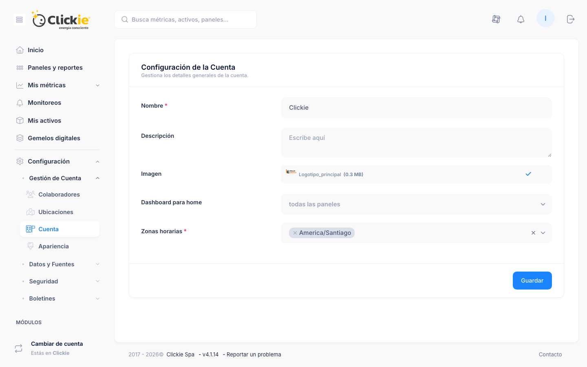

# Configuración de cuenta

La sección de **Configuración de cuenta** centraliza la administración de colaboradores, datos de cuenta y apariencia.

## Captura de la sección

*Vista de los campos generales de cuenta, dashboard por defecto y zona horaria.*

## Gestión de cuenta

Incluye:

- Colaboradores (ver, modificar, eliminar)
- Datos de cuenta
- Zona horaria
- Dashboard para home

## Apariencia de cuenta

Permite ajustar:

- Nombre del sitio
- Texto descriptivo
- Encabezado de bienvenida
- Icono de pestaña
- Subdominio de Clickie
- Logo de autenticación e imagen de autenticación
- Logo interno
- Color de marca

## Referencias

- [Datos y fuentes](./datos-y-fuentes.md)
