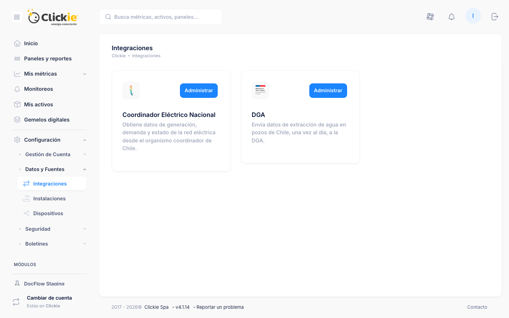
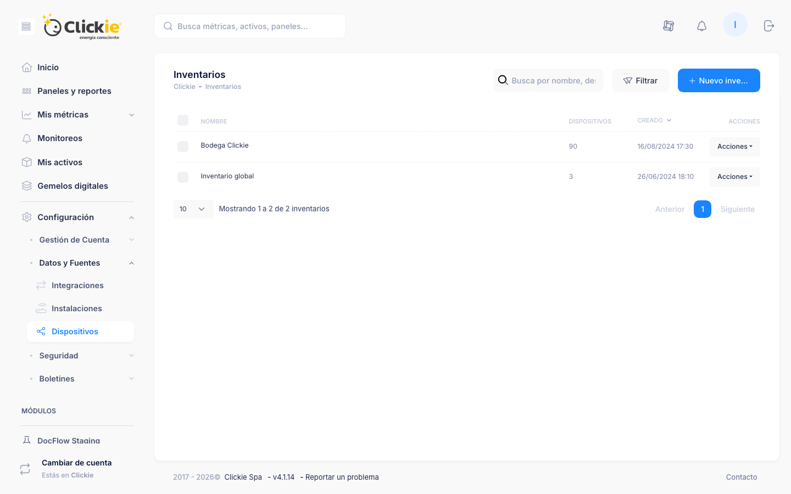

# Datos y fuentes

La sección **Datos y fuentes** concentra la gestión de orígenes de datos para la cuenta.

## Captura de la sección

*Módulo Integraciones con conectores disponibles para la cuenta.*

*Inventario de dispositivos asociados a la cuenta y sus acciones de administración.*

## Instalaciones

Listado de instalaciones con:

- Nombre
- Activo asociado
- Dispositivo asociado
- Fecha de creación
- Acciones disponibles

## Dispositivos

Inventario de dispositivos con:

- Nombre
- Tipo
- Fecha de creación
- Acciones disponibles

## Referencias

- [Configuración de cuenta](./cuenta.md)
- [Métricas](../conceptos/metricas.md)
