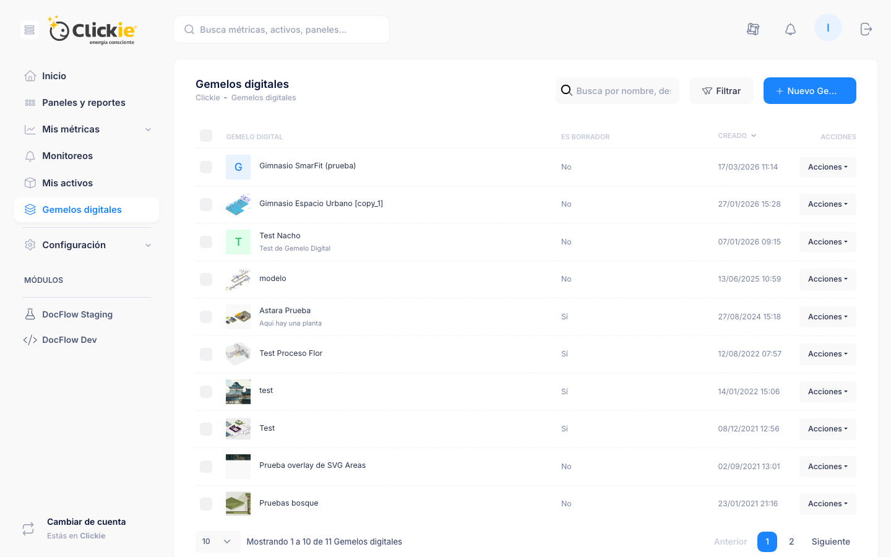

# Gemelos digitales

Los **Gemelos digitales** representan activos en una vista visual con datos en tiempo real provenientes de métricas, fórmulas y etiquetas.

:::module-strip
Gemelos digitales combina contexto visual y dato operativo para que los equipos interpreten más rápido el estado de una instalación, equipo o proceso.
:::

## Captura de la sección

*Vista de la sección Gemelos digitales con estado de publicación y acciones disponibles.*

## Para qué sirve este módulo

Gemelos digitales conecta operación y comunicación visual en un mismo entorno.

Permite:

- mostrar estado operativo de equipos e instalaciones,
- dar contexto gráfico a los datos,
- y crear experiencias de consulta más intuitivas para usuarios técnicos y no técnicos.

## Gestión del módulo

El listado principal permite revisar:

- nombre,
- estado (`borrador` o `publicado`),
- fecha de creación,
- acciones disponibles.

## Acciones disponibles

- **Ver**: abrir el gemelo operativo.
- **Diseñar**: editar variables y superposiciones.
- **Info**: revisar metadatos e identificadores.
- **Configuración**: ajustar nombre, descripción y layout.
- **Archivar**: ocultar sin eliminar.
- **Publicar/Borrador**: controlar el estado de exposición.

## Diseño: flujo recomendado

:::steps
1. **Configurar variables**: En **Diseñar > Variables > + Nueva variable** definir nombre, origen de datos, extracción, formato numérico y presentación de UOM.
2. **Configurar superposiciones**: En **Diseñar > Superposiciones > + Nueva superposición** definir tipo, visibilidad y tamaño fijo.
3. **Validar experiencia final**: Abrir **Ver** para revisar lectura, jerarquía visual y acción de overlays.
:::

Campos comunes de superposiciones:

- tipo de superposición,
- visibilidad predeterminada,
- tamaño fijo.

Tipos principales:

- Capa de fondo
- Contenedor
- Acción clicable
- Texto enriquecido
- Puntero
- Control PLC

## Criterios de calidad recomendados

- Priorizar legibilidad: menos elementos, mejor jerarquía.
- Evitar saturar la vista con indicadores redundantes.
- Mantener consistencia de nombres entre métrica, variable y etiqueta.
- Publicar solo gemelos validados con usuarios finales.

## Referencias

- [Activos](../organizacion/activos.md)
- [Métricas y fórmulas](../conceptos/metricas.md)
- [Selector de métricas](../conceptos/selector.md)
