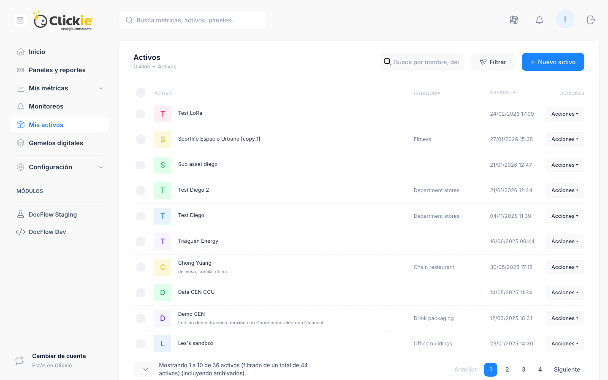

# Activos

El módulo **Activos** organiza métricas, paneles y gemelos bajo una unidad lógica común para mejorar navegación y contexto operativo.

## Captura de la sección

*Vista del listado de activos con categoría, fecha de creación y menú de acciones.*

## Datos del listado

Por cada activo se visualiza:

- Nombre
- Categoría
- Fecha de creación
- Acciones disponibles

## Secciones del detalle de un activo

- **Resumen**
- **Subactivos**
- **Métricas**
- **Gemelos digitales**
- **Instalaciones**
- **Documentos**
- **Actividad**

## Referencias

- [Gemelos digitales](../modelado/gemelos-digitales.md)
- [Métricas](../conceptos/metricas.md)
- [Paneles y reportes](../analisis/paneles.md)
