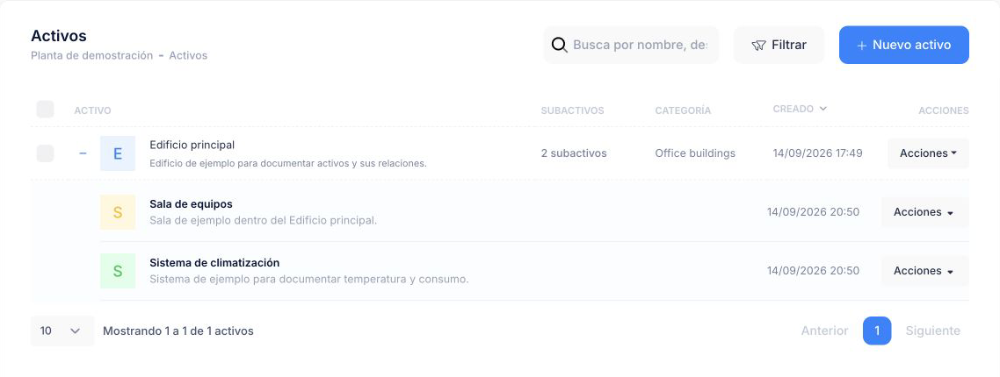
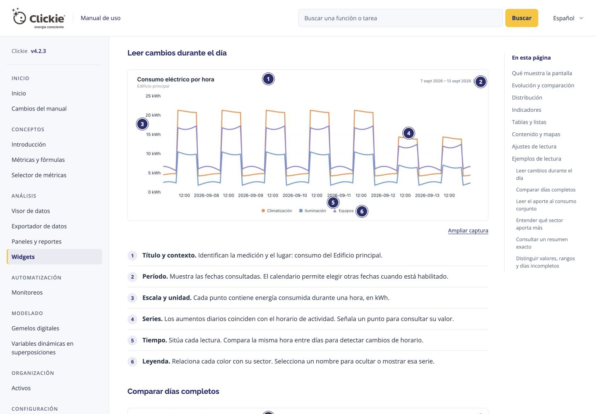

# Revisión y propuesta de actualización de Clickie Docs

Fecha de revisión: 14 de septiembre de 2026. Referencia funcional local: Clickie4 4.2.3.

La organización actual se conserva. La documentación se dirige a **clientes que ya utilizan Clickie, de cualquier rol**. Su propósito es ayudarles a completar tareas; no necesita presentar beneficios comerciales ni convencerlos de usar la plataforma. La actualización debe alinear la identidad visual y explicar la interfaz actual con el mínimo texto necesario, ejemplos y capturas reproducibles.

El alcance de implementación de esta primera etapa es **sustituir la marca recreada por logos oficiales**. El rediseño, la ampliación editorial y la matriz de capturas de este documento son propuestas; no se presentan como cambios ya implementados. La preparación del fixture local se documenta en Clickie4. Las capturas sólo se considerarán terminadas cuando exista una imagen revisada del estado indicado.

## 1. Qué se revisó

- Estructura de navegación en [mkdocs.yml](../mkdocs.yml), fuentes Markdown y generación del sitio React.
- Las 17 páginas funcionales en español y sus 17 equivalentes en inglés, incluyendo los respectivos changelogs. No se realizó una auditoría exhaustiva de endpoints API.
- Cobertura de navegación, métricas, selector, visor, paneles, activos, monitoreos, gemelos y boletines, contrastada con documentación y vistas del producto local.
- Identidad y fundamentos publicados en [Clickie Design Lab — Principios](https://design-lab.clickie.io/#principles) y su [contenido publicado](https://design-lab.clickie.io/content/generated/content.json).

La comparación con el repositorio identifica diferencias concretas, pero no acredita por sí sola que una función esté habilitada para cualquier cuenta. Cada recorrido debe contrastarse con la sesión y permisos del fixture antes de publicarlo como instrucción para usuarios.

## 2. Identidad oficial y adaptación propuesta

### Base tomada del Design Lab

La siguiente paleta y las familias tipográficas provienen del Design Lab, no de una reinterpretación del logo:

| Elemento | Referencia oficial |
| --- | --- |
| Azul Clickie | `#2b2e6f` |
| Amarillo Clickie | `#fdc400` |
| Oliva | `#7a8f18` |
| Texto | `#344054` |
| Fondo | `#f7f8fb` |
| Titulares | Raleway |
| Cuerpo | Open Sans |

Se deben utilizar exclusivamente archivos oficiales de marca, conservando proporciones y la variante apropiada para el fondo. El favicon también debe derivar de un recurso oficial. No se debe reconstruir el símbolo mediante una letra, tipografía, CSS o un dibujo nuevo.

En el estado auditado, la cabecera recreaba la marca con una insignia «C» y texto. Esta primera entrega ya la reemplaza en [generate_web_docs.mjs](../scripts/generate_web_docs.mjs) por el SVG oficial blanco y utiliza los SVG oficiales para el favicon. La [procedencia de los archivos](../public/assets/brand/README.md) queda registrada. Los colores de [manual.css](../src/manual.css) todavía usan azul `#20217F`, oliva `#7A8C1F` y otros tonos de texto; su alineación forma parte del rediseño propuesto.

### Decisiones propuestas para este manual

Las medidas siguientes son decisiones de adaptación editorial. **No son medidas obligatorias citadas textualmente del Design Lab.**

- Reducir las superficies azules extensas de cabecera y lateral. Usar fondos claros, separadores suaves y azul para orientación, enlaces y estados activos.
- Reservar el amarillo para acentos y llamadas puntuales. Evitar que cada sección compita mediante franjas, tarjetas o adornos repetidos.
- Proponer cuerpo de **16 px**, interlineado cómodo y ancho de lectura máximo de **70 caracteres aproximados (`70ch`)**. Las tablas técnicas y capturas podrán superar esa medida cuando lo necesiten.
- Diferenciar claramente título de página, subtítulos, instrucciones, notas y pies de imagen. Cada artículo debería permitir encontrar una tarea sin leer toda la introducción.
- Dar prioridad a las instrucciones. Eliminar copy comercial, promesas genéricas y explicaciones de implementación que no ayuden al cliente a completar la tarea.
- Mantener búsqueda, idioma y navegación por las secciones existentes. Añadir un índice local del artículo y enlaces anterior/siguiente cuando ayuden a continuar el recorrido.
- Ofrecer navegación accesible en pantallas estrechas para el **sitio documental**. Hoy la regla inferior a 920 px de [manual.css](../src/manual.css), línea 689 al revisar, oculta `.sidebar`; el generador y [App.jsx](../src/App.jsx) no ofrecen un menú alternativo. La propuesta es un botón «Contenido» con apertura/cierre por teclado, foco visible y estado anunciado. Esto no amplía la validación de Clickie4 a móvil: las capturas del producto seguirán siendo de escritorio.
- Mantener un tratamiento común para capturas: imagen nítida, borde discreto, leyenda que diga qué observar y ampliación accesible. Evitar recortes que oculten la acción explicada.

## 3. Hallazgos y prioridades editoriales

| Prioridad | Diferencia observada | Acción propuesta y evidencia |
| --- | --- | --- |
| Alta | El Selector se explica sólo mediante «Explorar» y «Selección actual». | Actualizar [Selector de métricas](../docs/conceptos/selector.md), líneas 42–45: el modal V2 tiene dos pasos y borradores; los hosts integrados mantienen pestañas. Incluir selección, personalización, procesamiento y aplicar/cancelar. Referencia: [Metric selection](../../clickie-platform/clickie4/docs/metrics/metric-selection.md), líneas 7–17. |
| Alta | Boletines presenta «Enviar ahora» desde Diseño. | Corregir [Boletines](../docs/configuracion/boletines.md), líneas 60 y 86. La versión 4.2.2 eliminó el envío desde la vista previa, según [Newsletter Design](../../clickie-platform/clickie4/docs/newsletters/newsletter_design.md), líneas 16–18. Explicar preview y envío como operaciones separadas según las acciones efectivamente disponibles. |
| Alta | Paneles describe el listado y sus acciones, sin enseñar a construir un panel. | Ampliar [Paneles y reportes](../docs/analisis/paneles.md), líneas 18–38, con un panel terminado, un widget, su selección de métricas, subpaneles y navegación. La app conserva el subpanel activo al abrir un enlace: [Dashboards](../../clickie-platform/clickie4/docs/dashboards/dashboards.md), líneas 4–11. |
| Alta | Activos enumera pestañas, pero no explica jerarquía ni relaciones. | Ampliar [Activos](../docs/organizacion/activos.md), líneas 18–35, con raíces/subactivos, vinculación de recursos y campos opcionales. Explicar la diferencia entre conservar historial de un atributo y corregir su valor. Referencia: [Assets](../../clickie-platform/clickie4/docs/resources/assets.md), líneas 6–28. |
| Media | Métricas contiene definiciones y fórmulas, pero no un recorrido completo de creación y validación. | Añadir a [Métricas y fórmulas](../docs/conceptos/metricas.md) una métrica de origen y una calculada, con previsualización y resultado esperado. Introducir configuración de operandos, consolidados por zona horaria y datos faltantes cuando corresponda. Referencia: [Metrics Overview](../../clickie-platform/clickie4/docs/metrics/metrics_overview.md), líneas 3–17. |
| Media | Visor describe capacidades sin mostrar una exploración con datos y una decisión verificable. | En [Visor de datos](../docs/analisis/visor-datos.md), sustituir la captura genérica por una consulta cargada con rango explícito; explicar unidades, agregación, interpolación y exportación mediante un caso único. Confirmar qué visualizaciones ofrece el selector actual antes de cerrar su catálogo. |
| Media | Monitoreos se concentra en configuración y omite la lectura posterior de eventos. | Completar [Monitoreos](../docs/automatizacion/monitoreos.md) con Resumen, Historial y Actividad. Esas secciones están presentes en [Monitors.php](../../clickie-platform/clickie4/app/Controllers/Monitors.php), líneas 58–89. Capturar configuración e interpretación sin provocar notificaciones. |
| Media | Gemelos muestra el listado, sin un ejemplo visual terminado. | Ampliar [Gemelos digitales](../docs/modelado/gemelos-digitales.md), líneas 17–20 y 50–71, con la misma instalación en diseño y consulta, una variable y una superposición. Conservar la guía específica de variables dinámicas. |
| Media | El catálogo de boletines enumera sólo cuatro tipos de bloque. | Revisar [Bloques de contenido](../docs/configuracion/boletines-bloques.md), líneas 29–36, contra los tipos habilitados en la cuenta. La documentación del producto ya registra historial de monitoreos y comparación de métricas: [Newsletter Design](../../clickie-platform/clickie4/docs/newsletters/newsletter_design.md), líneas 25–28. |
| Media | Las capturas no acompañan operaciones concretas y falta paridad entre idiomas. | Las fuentes ES tienen 15 referencias de imagen; EN no tiene ninguna. Selector y Visor reutilizan `metrics_viewer.png`; la guía de bloques usa el listado de boletines. Sustituir por capturas de tareas, con referencias compartidas y leyendas por idioma. |
| Media | La traducción inglesa contiene errores semánticos y de formato. | [Dashboards and reports](../docs/en/analisis/paneles.md), línea 21, traduce «Acciones comunes» como «Common Stock»; [Newsletters](../docs/en/configuracion/boletines.md), línea 94, une título y primera viñeta; [Home](../docs/en/index.md), línea 53, conserva en español el título de una directiva. Revisar EN después de estabilizar ES y mantener un glosario. |
| Alta | El texto repite beneficios en lugar de enseñar acciones. | Recortar «Para qué sirve en términos de negocio» de [Selector](../docs/conceptos/selector.md), «Valor para usuarios y clientes» de [Visor](../docs/analisis/visor-datos.md), «Qué aporta a la operación» de [Monitoreos](../docs/automatizacion/monitoreos.md) y franjas introductorias que reiteran esos mensajes. Conservar únicamente contexto que cambie una decisión o evite un error real. |

Las referencias de línea corresponden al estado revisado y pueden desplazarse con la edición. Los enlaces apuntan a los archivos fuente, no a HTML generado.

## 4. Estructura conservada

No se propone reorganizar los grandes grupos del manual. La ampliación ocurre dentro de ellos:

| Sección actual | Contenido a completar |
| --- | --- |
| Inicio | Orientación, contexto de cuenta, búsqueda, ruta de aprendizaje y primer resultado útil. |
| Conceptos | Métrica de origen/calculada, unidades, resolución, agregación, interpolación, selector y fórmulas con un ejemplo común. |
| Análisis | Explorar una serie, comparar, exportar, crear panel/widget y organizar subpaneles. |
| Automatización | Configurar un monitoreo y luego interpretar su estado, historial y actividad. |
| Modelado | Construir y consultar un gemelo; variables y superposiciones con un resultado visible. |
| Organización | Jerarquía de activos, relaciones y mantenimiento de atributos. |
| Configuración | Cuenta y fuentes; boletines, bloques, grupos y plantillas con sus permisos y estados reales. |
| API v4 | Mantener como referencia técnica separada. Los enlaces desde guías funcionales deben resolver una necesidad concreta. |
| Changelog | Resumir cambios del manual y registrar la validación de los recorridos. |

### Criterio central de redacción

Cada frase debe indicar una acción, explicar un control, describir el resultado o resolver un error real. Si no cumple ninguna de esas funciones, se elimina. No se presupone conocimiento técnico ni un rol concreto; los permisos se explican sólo cuando cambian el acceso o la acción disponible.

Plantilla compacta: **qué permite, en una línea sólo si hace falta → dónde abrirlo → pasos → resultado**. Añadir permisos o contexto únicamente cuando afecten la tarea, y soluciones sólo para errores comprobados. Evitar secciones vacías o un bloque de «buenas prácticas» automático en cada página.

No trasladar a la documentación del cliente nombres de servicios internos, contratos de datos o mecanismos de implementación. Esos detalles pertenecen al registro del fixture o a la documentación técnica. Usar las mismas palabras que aparecen en los controles de Clickie; explicar un término nuevo cuando sea necesario para actuar.

### Ejemplo de recorte

Texto actual de [Selector de métricas](../docs/conceptos/selector.md):

> El Selector de métricas es la puerta de entrada para convertir datos disponibles en decisiones consistentes. Se usa en toda la plataforma y evita configuraciones aisladas por módulo.

Propuesta de instrucciones que lo reemplazan:

1. Abre el selector y busca la métrica por nombre.
2. Selecciona las métricas que quieres usar.
3. Personaliza el nombre, la unidad o el procesamiento cuando lo necesites.
4. Confirma la selección para volver al formulario.

Los cambios de esta selección se aplican a la visualización que estás configurando. No modifican la métrica de origen.

Los nombres exactos de botones y pasos se ajustarán al host capturado: el modal y el selector integrado no presentan la misma navegación. El ejemplo ilustra el criterio editorial, no sustituye esa validación.

Las fechas actuales de muchas páginas son de marzo/abril de 2026. Además de `last_updated`, se propone registrar «Recorrido validado en Clickie 4.2.3 · fecha» una vez comprobado. Una actualización de estilo no debe presentarse como validación funcional.

## 5. Fixture para capturas

### Escenario común

El fixture utiliza el nombre **Planta de demostración** y las entidades **Edificio principal**, **Sala de equipos** y **Sistema de climatización**. Ese vocabulario se conserva entre artículos para que cada pantalla continúe el ejemplo anterior.

Nombres propuestos para los recursos:

- Métricas: **Consumo de energía**, **Potencia eléctrica**, **Temperatura ambiente**, **Caudal de agua** y **Factor de potencia**.
- Métrica calculada: **Consumo por superficie**; su fórmula debe corresponder a las unidades y datos que finalmente se utilicen.
- Panel: **Resumen operativo**, con subpaneles **Energía** y **Confort**.
- Monitoreo: **Temperatura fuera de rango**.
- Gemelo: **Vista del edificio**.
- Boletín: **Resumen semanal de operaciones**; grupo **Equipo de demostración**.

Estos nombres son un contrato editorial propuesto, no un inventario de recursos ya creados. El MD de Clickie4 debe distinguir claramente lo preparado, lo capturado y lo pendiente.

### Límite técnico identificado

La aplicación y su base de datos están disponibles localmente con una sesión abierta. Sin embargo, los gráficos consultan **`api.clickie.io` incluso desde la aplicación local**. Crear entidades locales no garantiza que existan series temporales para esas métricas en el lector de datos.

Por ello no se promete que ya haya series sintéticas ni capturas cargadas. Antes de capturar gráficos se debe elegir y documentar una vía que devuelva datos del fixture sin escribir en producción. Si no existe esa vía, se podrán capturar los formularios y estados locales disponibles, dejando las imágenes de resultados pendientes. Un estado vacío debe documentarse como tal, nunca presentarse como una gráfica operativa completa.

Los boletines permanecerán pausados y las capturas de monitoreos no activarán comunicaciones. La preparación no requiere destinatarios reales ni envíos de prueba. Los datos visibles deben ser genéricos en español; cualquier contenido real que aparezca en la sesión debe quedar fuera del encuadre o sustituirse en el fixture antes de capturar.

### Registro reproducible en Clickie4

El documento del fixture debe describir:

1. Propósito, alcance local, versión del producto y estado de preparación.
2. Entidades creadas, relaciones y nombres visibles.
3. Mecanismo de creación y cómo repetirlo sin duplicar registros.
4. Origen efectivo de los datos, periodo, resolución y zona horaria.
5. Rutas y estados de pantalla para cada captura, con sus archivos de salida.
6. Opciones pausadas, límites conocidos y pasos pendientes.
7. Comprobaciones realizadas y resultado observado.

No incluir credenciales, cookies, datos personales ni identificadores de producción. Si un paso necesita la sesión del operador, describir su uso sin exportarla al documento.

## 6. Matriz de capturas

### Primera tanda: 12 capturas esenciales

Capturas de escritorio con idioma español, escala constante y un rango temporal explícito cuando haya datos. El tamaño exacto de ventana se fija una vez al comenzar y se registra en el MD del fixture.

| ID | Artículo | Estado a capturar | Dependencia y resultado que debe enseñar |
| --- | --- | --- | --- |
| 01 | Inicio | Navegación general con contexto Planta de demostración | Entidades locales y nombre genérico visibles; identificar módulos y contexto. |
| 02 | Métricas | Detalle de Consumo de energía | Métrica preparada; mostrar identidad, unidad y fuente de forma comprensible. |
| 03 | Selector | Primer paso de selección | Catálogo genérico; mostrar cómo encontrar y elegir métricas. |
| 04 | Selector | Personalización de selección | Selección previa; mostrar nombre, unidad y procesamiento, con acciones de aplicar/cancelar. |
| 05 | Visor | Gráfica cargada con dos series y periodo definido | Requiere una vía de lectura de datos del fixture comprobada. Mostrar tendencia y comparación; pendiente si no hay datos. |
| 06 | Paneles | Resumen operativo terminado | Requiere widgets y datos comprobados; enseñar el resultado final del recorrido. |
| 07 | Paneles | Configuración de un widget | Panel y métricas locales; explicar dónde se eligen fuentes y presentación. |
| 08 | Activos | Raíz y subactivos con jerarquía expandida | Relaciones locales; enseñar Planta de demostración y sus unidades. |
| 09 | Monitoreos | Regla de Temperatura fuera de rango | Configuración local sin comunicaciones activas; mostrar métrica, método, umbral y frecuencia. |
| 10 | Gemelos | Vista del edificio terminada | Fondo y superposiciones preparados; valores dinámicos sólo si su lectura está comprobada. |
| 11 | Gemelos | Editor de variable o superposición | Gemelo local; mostrar cómo se vincula información al contexto visual. |
| 12 | Boletines | Diseño de Resumen semanal de operaciones | Bloques locales; preview sólo si funciona con los datos elegidos, sin enviar el boletín. |

### Ampliación posterior: hasta 30 capturas totales

Estas 18 imágenes adicionales elevan la cobertura a 30; se seleccionarán sólo cuando aporten una explicación distinta. Una entrega de 25 puede omitir las cinco menos relevantes para la audiencia inicial.

| ID | Captura adicional | Objetivo |
| --- | --- | --- |
| 13 | Búsqueda global con resultados genéricos | Encontrar un recurso sin recorrer el menú. |
| 14 | Listado de métricas | Ubicar filtros, búsqueda y acciones. |
| 15 | Editor de métrica calculada con preview | Validar un indicador antes de guardarlo. |
| 16 | Fórmula y personalización de operandos | Explicar los modos de cálculo con sus controles reales. |
| 17 | Exportador de datos | Seleccionar periodo y formato sin ambigüedad. |
| 18 | Opciones de lectura del Visor | Relacionar resolución y agregación con la pregunta de análisis. |
| 19 | Subpanel Energía activo | Mostrar organización y enlace que restaura su pestaña. |
| 20 | Listado de monitoreos | Interpretar estado y severidad. |
| 21 | Historial de monitoreo | Leer un evento y su evolución; necesita datos adecuados. |
| 22 | Resumen o Actividad de monitoreo | Diferenciar configuración de seguimiento. |
| 23 | Detalle de activo con recursos relacionados | Mostrar que las relaciones conectan módulos. |
| 24 | Campos opcionales e historial de atributos | Explicar registrar un cambio frente a corregir un valor. |
| 25 | Listado de gemelos | Mostrar borrador/publicación según controles habilitados. |
| 26 | Superposición y variable dinámica | Vincular diseño y resultado visual. |
| 27 | Configuración de boletín pausado | Explicar horario, zona y estado sin ejecutar envíos. |
| 28 | Grupo Equipo de demostración | Mostrar una audiencia genérica sin contactos reales. |
| 29 | Plantilla de boletín | Distinguir estructura visual de contenido. |
| 30 | Edición de bloque de comparación o tendencia | Explicar parámetros y comprobar el catálogo actual. |

Cada archivo final debe tener nombre estable, por ejemplo `selector-personalizacion-es.png`, y una leyenda que describa qué observar. Los identificadores de esta matriz permiten registrar aprobación o pendiente sin cambiar rutas arbitrariamente.

## 7. Fases de trabajo y criterios de cierre

### Fase 1 — Identidad oficial

Sustituir marca recreada y favicon por recursos oficiales. Registrar procedencia y mantenerlos como archivos locales del sitio. Comprobar cabecera, nitidez, proporciones, texto alternativo y regeneración del HTML. Este es el cambio visual acotado de la primera etapa; no equivale a ejecutar el rediseño propuesto.

### Fase 2 — Muestra de estilo y patrón editorial

Aplicar la propuesta visual a Inicio y a un artículo representativo, preferentemente Selector. Resolver tipografía, ancho de lectura, jerarquía, navegación estrecha, notas y capturas. Cerrar la muestra con una revisión visual y de teclado; extenderla al resto sólo después de fijar ese patrón.

### Fase 3 — Fixture y 12 capturas esenciales

Preparar las entidades locales y registrar el procedimiento en Clickie4. Resolver explícitamente la dependencia de datos del lector remoto antes de prometer gráficos. Capturar y revisar los 12 estados esenciales disponibles, registrando por separado cualquier pendiente. No modificar comportamiento productivo para obtener una imagen.

### Fase 4 — Actualización funcional en español

Eliminar el copy comercial y las introducciones repetidas. Corregir primero Selector, Paneles, Activos y el flujo de preview de Boletines. Continuar con Métricas, Visor, Monitoreos y Gemelos. Utilizar las capturas para explicar tareas y resultados. Comprobar etiquetas, rutas, permisos, links y fechas de validación contra la interfaz local. Revisar cada artículo como lo leería un cliente de cualquier rol que necesita completar una tarea, sin añadir contexto técnico interno.

### Fase 5 — Paridad inglesa y cobertura adicional

Actualizar EN desde el contenido ES estabilizado, revisar semántica y formato y compartir capturas con leyendas apropiadas. Extender la matriz hacia 25–30 imágenes sólo donde falte un paso o una decisión. Registrar cambios y compilar el sitio.

La propuesta se considera ejecutada cuando la identidad usa únicamente recursos oficiales, los recorridos principales coinciden con la interfaz comprobada, cada captura es reproducible y genérica, las limitaciones de datos están declaradas y ambos idiomas conservan la misma cobertura. Un build correcto verifica la generación del sitio; no reemplaza la comprobación funcional de las instrucciones.

## 8. Estado de esta primera entrega

- Logos oficiales instalados en la cabecera, favicon y HTML legados; sitio compilado y comprobado en `https://docs.clickie.test/`.
- Cuenta local **Planta de demostración** creada y asociada a la sesión existente.
- **Edificio principal** creado con dos subactivos: **Sala de equipos** y **Sistema de climatización**.
- Panel **Resumen operativo** creado y vinculado al edificio; todavía sin widgets ni series.
- Una captura piloto real de la jerarquía revisada, con nombres genéricos. El recorte excluye la cabecera personal y conserva la interfaz tal como se muestra. La categoría `Office buildings` procede del catálogo actual y no fue retocada en la imagen.
- El procedimiento y los identificadores locales están registrados en `clickie4/docs/tools/documentation-fixture.md`, en la hoja de trabajo `feature/main/clickie4/v4.2.3/documentation-fixture`.
- Rediseño, reescritura de artículos, series sintéticas y las restantes capturas: propuestos para las siguientes etapas.

**Captura piloto: consultar los subactivos de un edificio.**

## Implementación local — 2026-09-14

Referencia funcional fijada a v4.2.3, SHA `80841bd6`. Se aplicaron tipografías, colores y logos oficiales; lectura por artículo, búsqueda, índice y navegación ES/EN. Se revisaron 18 guías funcionales por idioma, incluyendo las nuevas guías de Widgets y Exportador. El catálogo cubre 26 widgets.

Se incorporaron 18 capturas numeradas reales: 12 de la aplicación local y 6 del renderer original de widgets con series sintéticas. La cuenta local contiene activos, panel vacío, tres definiciones de métricas y un monitoreo pausado. Las muestras del renderer no están guardadas en el panel ni en las métricas locales. Los detalles reproducibles se mantienen en el MD de fixture de Clickie4.

Las guías de gemelos digitales, cuenta, fuentes y boletines se revisaron contra el código de esta versión; sus capturas específicas quedan como ampliación visual del inventario. La referencia API se mantiene separada de la versión del manual de uso. No hubo publicación remota.

Verificación final: compilación correcta; 4.458 identificadores únicos, enlaces internos e imágenes válidos; 18 capturas con numeración y leyendas equivalentes en ES/EN. Se comprobaron navegación entre artículos, búsqueda por teclado, cambio de idioma, selección de leyendas, ampliación de imágenes y menú móvil a 390 px, sin desbordamiento horizontal. La consola no registró errores ni advertencias. Vite conserva una advertencia de tamaño del paquete por incluir el manual y la referencia API en el mismo archivo.

